# Mental_Health_prediction_using_ML
The project develops a ML solution by implementing multiple algorithms to solve a specific problem. Through rigorous evaluation, the project assesses algorithm performance considering accuracy, speed, and resource requirements. The best algorithm is selected based on optimal results, balancing efficiency and effectiveness.

Data= survey.csv

The dataset contains 1259 rows and 27 columns.

 
<b>Dataset column</b>

'Timestamp', 'Age', 'Gender', 'Country', 'state', 'self_employed','family_history', 'treatment', 'work_interfere', 'no_employees','remote_work', 'tech_company', 'benefits', 'care_options','wellness_program', 'seek_help', 'anonymity', 'leave','mental_health_consequence', 'phys_health_consequence', 'coworkers',
 'supervisor', 'mental_health_interview', 'phys_health_interview','mental_vs_physical', 'obs_consequence', 'comments'

 
(dtype='object')
 

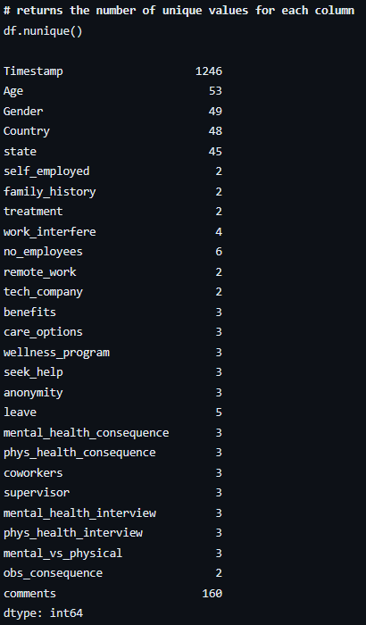

<b>#&nbspPloting image of attribute with it's data</b>

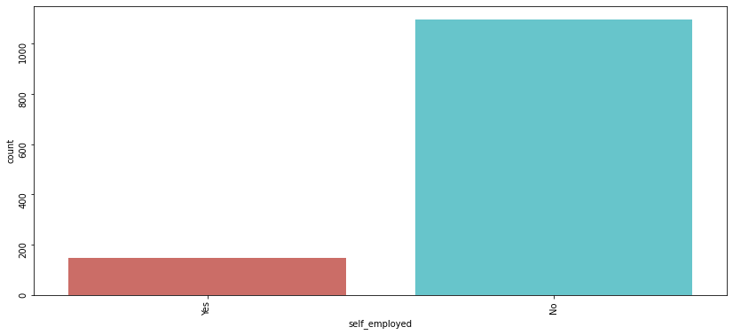 
       

<b>#&nbspBoxplot of age attribute</b>

 

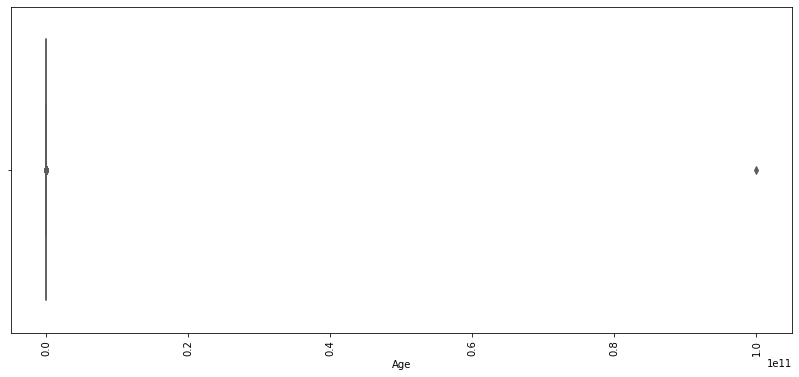

<b>#&nbspFiltering the age</b>

df.drop(df[df['Age'] < 0].index, inplace = True) 
df.drop(df[df['Age'] > 100].index, inplace = True)
 

<b>#&nbspPrint unique number</b>

df['Age'].unique() 
[37, 44, 32, 31, 33, 35, 39, 42, 23, 29, 36, 27, 46, 41, 34, 30, 40, 38, 50, 24, 18, 28, 26, 22, 19, 25, 45, 21, 43, 56, 60, 54, 55, 48, 20, 57, 58, 47, 62, 51, 65, 49,  5, 53, 61,  8, 11, 72]) 

<b>#&nbspHisplot figure</b>

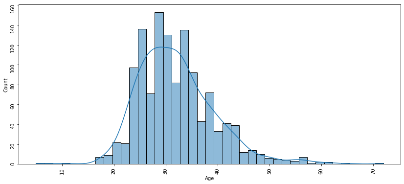 

<b>#&nbspUnique data</b>

df['Gender'].unique() 
array(['Female', 'Male', 'Other'], dtype=object) 

 
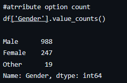 

<b>#&nbspFigure</b>

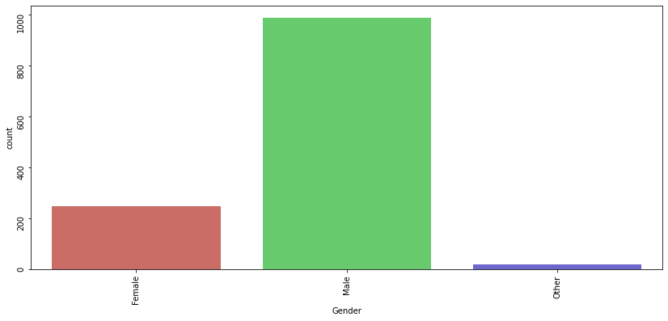 

<b>#&nbspPie chart</b>

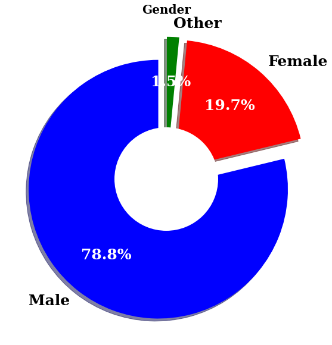 

<b>#&nbspFigure of attribute like (self employed) with treatement</b>

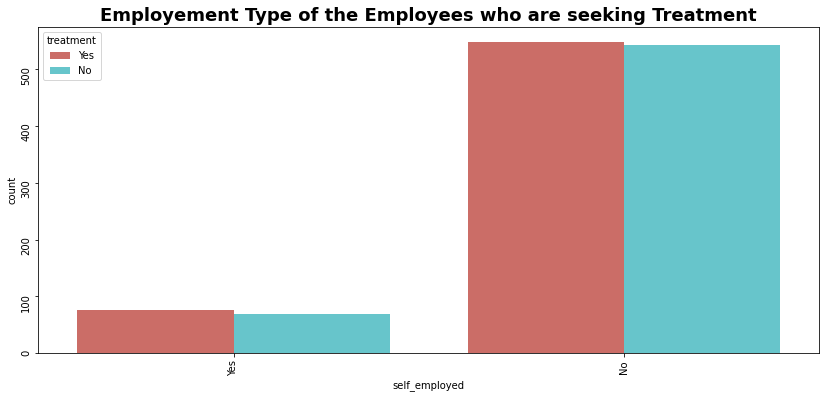 

<b>#&nbspHeat map</b>

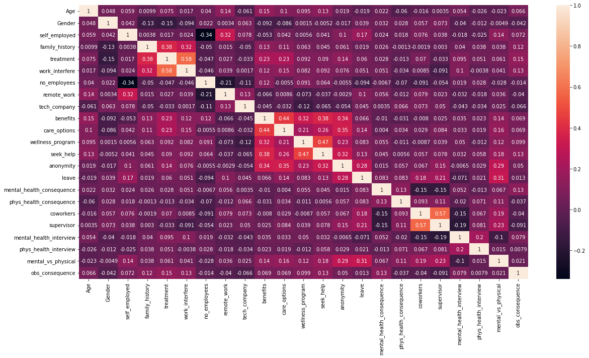 

<b>#&nbspAccuracy of all ML algorithm</b>

LogisticRegression 0.7898089171974523 
KNeighborsClassifier 0.697452229299363 
DecisionTreeClassifier 0.7484076433121019 
RandomForestClassifier 0.802547770700637 
GradientBoostingClassifier 0.8057324840764332 
AdaBoostClassifier 0.7866242038216561 
XGBClassifier 0.7961783439490446 

<b>#&nbspData in figure</b>
 
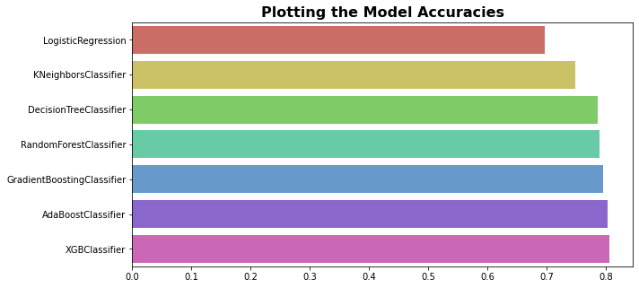 

<b>#&nbspSelecting ML having high accuracy</b>

The Algorithm which gives maximum accuracy... 
GradientBoostingClassifier : 0.8057324840764332

<b>#&nbspConfusion matrix of Gradient booster</b>

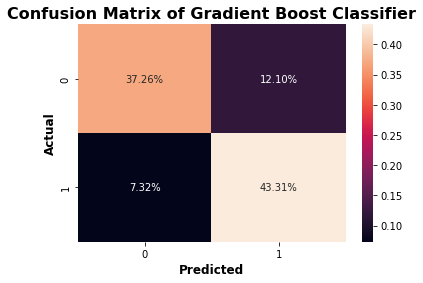 

<b>#&nbspROC curve</b>

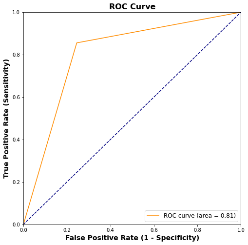
